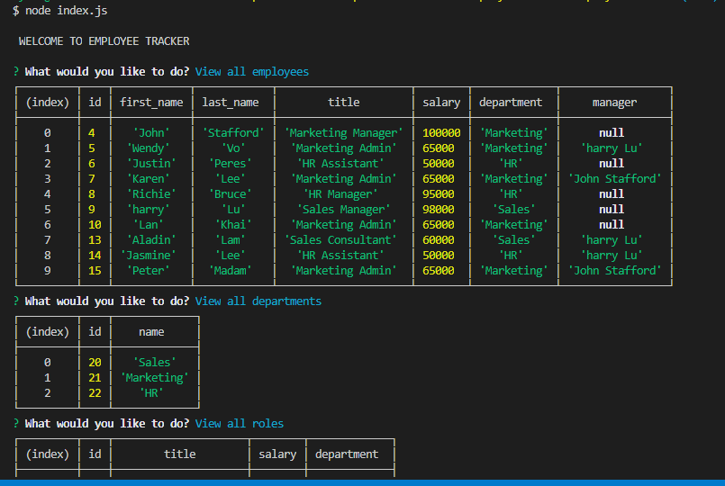

# Employee Tracker
    
  

## Description
Employee Tracker is a command-line application that allows the company to manage the employee database easily. By using this application, the user can:
- Add departments, roles, employees
- View departments, roles, employees
- Update employee roles
- Update employee managers
- View employees by manager
- Delete departments, roles, and employees
- View the total utilized budget of a department -- ie the combined salaries of all employees in that department

## Table of Contents
- [Description](#description)
- [Installation](#installation)
- [Technology](#technology)
- [Link to GitHub](#linktogithub)
- [Screenshots](#screenshots)
- [License](#license)
- [Contributing](#contributing)
- [Questions](#questions)

## Installation
npm init

npm install

## Technology 

- Node.js
- MySql
- JavaScript
- Inquirer
- Github
- console.table

## Link to GitHub:
[GitHub](https://github.com/wendyVo/employee-tracker.git)

## Link to Video for demonstration:

[DemoLink](https://drive.google.com/file/d/1Hij6p-hFoHWLvgLBP-X9pHHa4KbxcMmR/view?usp=sharing)

## Screenshots:
- Main CLI application
 

## License

 
This application is covered under  license. 

## Contributing
Contributors: Wendy Vo  
Please read this [Setting guidelines for repository contributors](https://docs.github.com/en/github/building-a-strong-community/setting-guidelines-for-repository-contributors) for more informations.

## Questions

Please contact me should you have any questions:  
:email:   Email: uyen199247@gmail.com  
:octocat: GitHub:  [wendyVo](https://github.com/wendyVo)

